# OpsClaw

**让业务信号成为有据可循的行动。**

OpsClaw 是面向数据运营场景的 Agent 工作台，将数据查看、缺口检测、证据调查、方案审批与执行跟踪连接起来。平台既可以直接配置模型运行内部 Agent，也可以通过 MCP 把业务数据、Skill 与受控工具开放给 Claude、Codex、GPT 等外部 Agent。两种入口共用同一套数据、规则和工具能力。

增长工作台支持从订单同比发现异常，结合站内行为与外部公告寻找线索，将审核后的因子转为长期监控，并通过可配置广告接口执行投放、预算调整与停止投放。

[核心功能](#核心功能) · [界面预览](#界面预览) · [快速开始](#快速开始) · [导入与分析](#导入与分析) · [增长工作台](#增长工作台) · [Agent 与模型](#agent-与模型) · [架构与边界](#架构与边界) · [Skill 与 MCP](#skill-与-mcp) · [开发](#开发)

源码入口：[Web 前端](web) · [后端服务](backend/opsweaver) · [使用文档](docs) · [自动化测试](backend/tests)

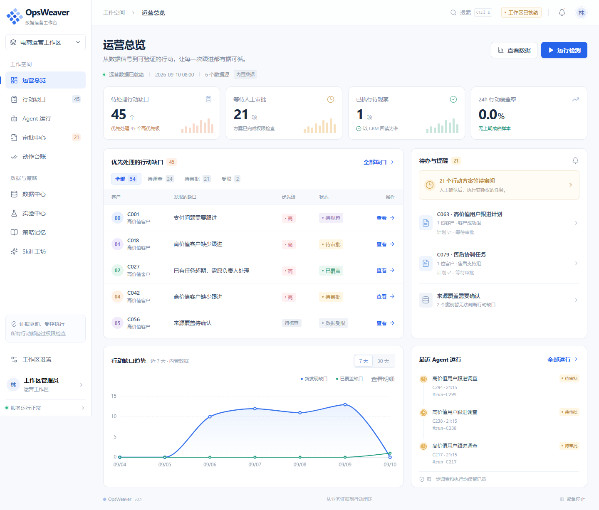

## 核心功能

- **模型连接**：配置 OpenAI 兼容或 Anthropic API，接入云端模型与 Ollama、vLLM 本地服务，测试连接并选择模型。
- **Agent 工作台**：多种内置 Agent、自定义指令与工具权限、按需求生成 Agent、选择数据集执行任务并查看多轮模型调用、工具调用与输出。
- **双入口 Agent 架构**：用户可直接使用 OpsClaw 内部 Agent，也可让外部 Agent 通过 MCP 复用同一套业务数据与受控工具；无需把业务逻辑复制到不同 Agent 中。
- **增长工作台**：电商订单字段映射、订单量与净 GMV 同比、品牌或市场、品类或客群、商品分组、异常与行为线索关联。
- **事件监控**：Brave Search 检索、官网公告轮询、因子审核、事件去重与错误退避。
- **广告生命周期**：内容资产匹配、机会预算测算、独立充值审批、预算及 ROI 调整、绩效回读与自动降预算/停投。
- **运营总览**：集中查看行动缺口、待审方案、执行进度、行动覆盖率和趋势，快速定位需要处理的事项。
- **文件接入**：批量导入 CSV、TSV、Excel（XLSX）、JSON 与 JSONL，自动识别字段与工作表，逐文件展示结果和错误。
- **数据分析**：保存文件来源与分析结果，查看记录预览、字段类型、缺失值、重复行、数值统计和高频值；符合业务字段要求的数据可继续接入运营检测。
- **缺口检测**：结合客户价值、交易变化、活跃趋势与跟进记录识别待处理事项，并按优先级组织案件。
- **证据调查**：关联交易、行为和工单信息，用流程图、节点详情与事件时间线呈现调查过程。
- **方案审批**：集中审阅客户范围、负责人、任务内容与依据，记录批准、拒绝和版本信息。
- **执行跟踪**：创建客户跟进任务、回读执行结果、核对任务状态，保留动作记录与后续观察状态。
- **自定义 Skill**：使用 Markdown 编写工作指令，配置输入参数和工具权限，支持版本管理、启停、参数测试与导出。
- **MCP 接入**：向其他 Agent 提供 Skill、业务上下文和授权工具，复用工作区中的数据与工作方法。

## 界面预览

### 客户与证据

在同一页面查看客户概况、业务信号、交易明细和行动建议。

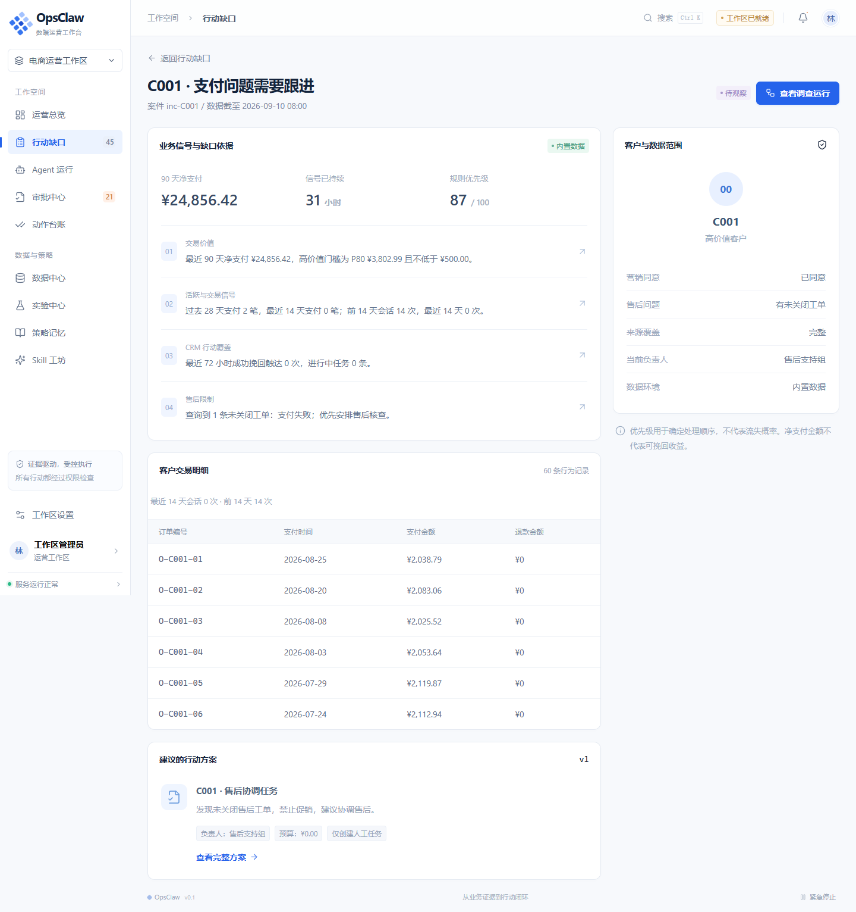

### 数据中心

按业务类型管理数据源，查看字段、覆盖情况与记录明细。

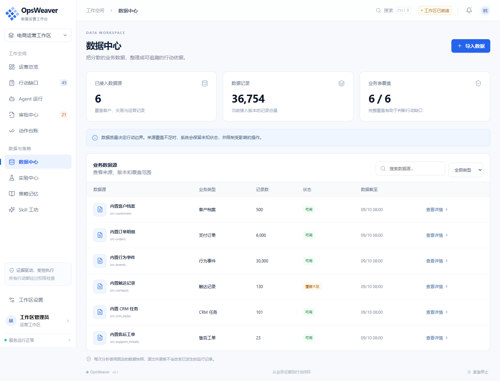

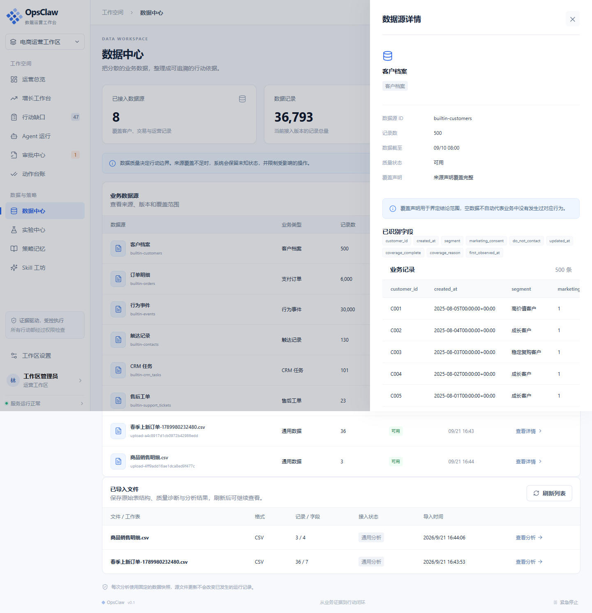

### 审批与工作流

从方案审阅到执行回读，沿着流程图和事件时间线跟踪任务进展。

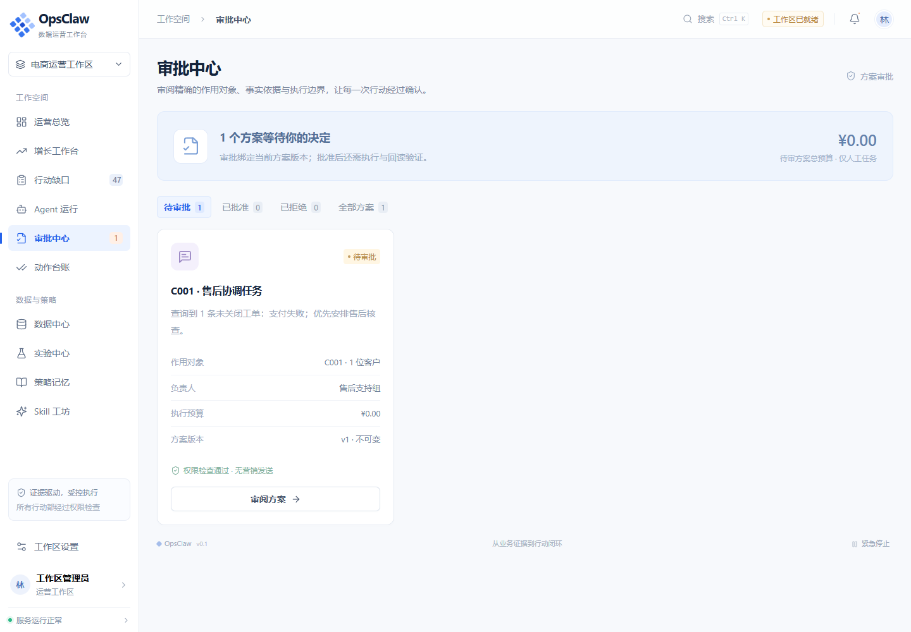

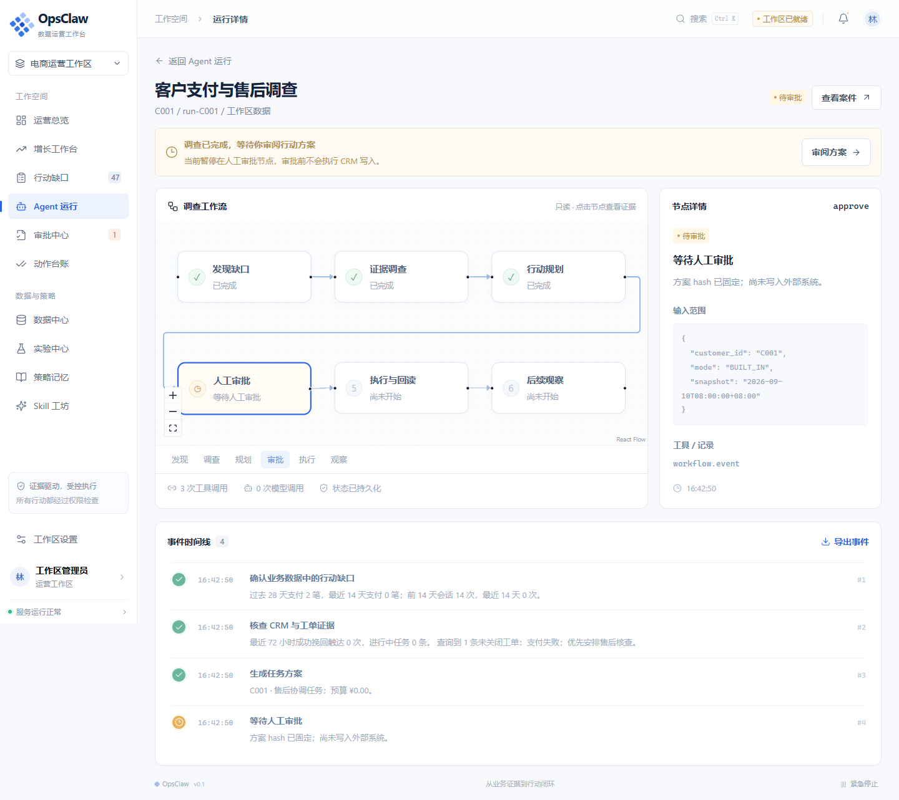

### Skill 工坊

将业务经验整理为可复用的工作指令，统一管理参数、版本和工具权限。

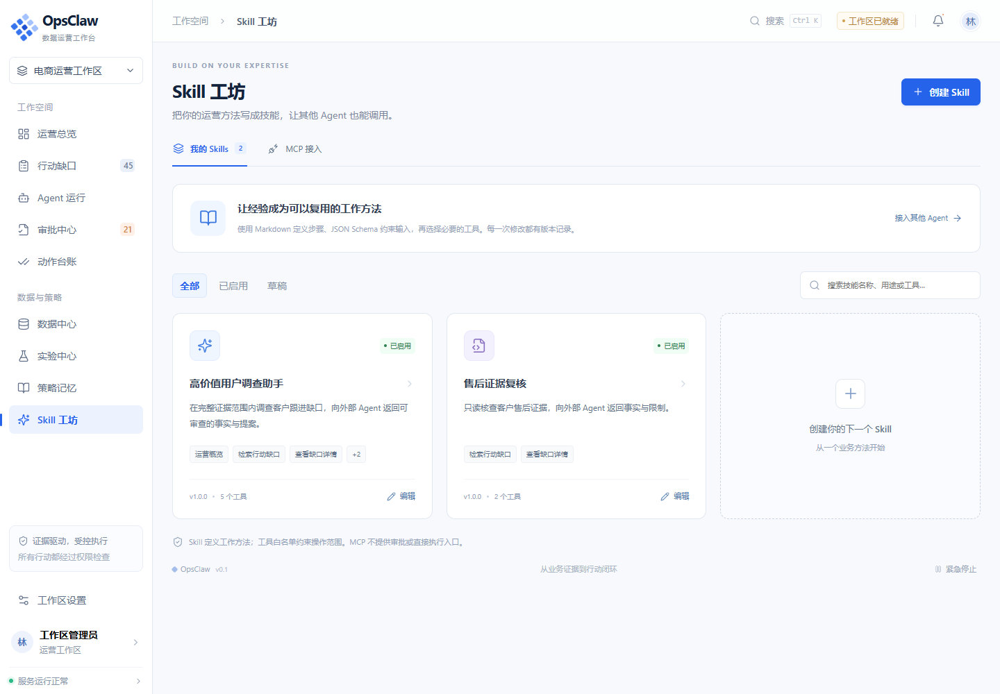

### 响应式布局

桌面与窄屏均可浏览工作区，查看关键指标、案件和任务状态。

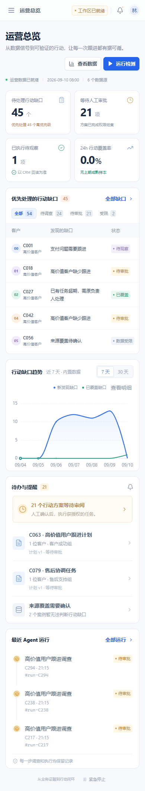

## 快速开始

### 环境要求

- Windows
- Git
- Node.js 22
- pnpm 10
- Python 3.13

以下命令使用 PowerShell，在仓库根目录执行。

### 1. 获取源码

```powershell
git clone https://github.com/small-lazy/OpsClaw.git
cd OpsClaw
npm install --global pnpm@10
```

### 2. 安装后端依赖

```powershell
py -3.13 -m venv .\backend\.venv
.\backend\.venv\Scripts\python.exe -m pip install -r .\backend\requirements.lock.txt
```

### 3. 安装前端依赖并构建

```powershell
Push-Location .\web
pnpm install --frozen-lockfile
pnpm build
Pop-Location
```

### 4. 启动应用

安装完成后，双击仓库根目录的 `启动行策.cmd` 即可启动三个服务并打开工作台；关闭时双击 `停止行策.cmd`。脚本会在首次启动或前端源码更新后构建前端，运行日志保存在 `.runtime`。

也可以手动启动各服务：

打开三个 PowerShell 终端，每个终端均从仓库根目录开始，依次运行以下服务。

**终端 1：客户任务服务**

```powershell
Set-Location .\backend
.\.venv\Scripts\python.exe -m uvicorn opsweaver.crm:app --host 127.0.0.1 --port 8101
```

**终端 2：业务 API**

```powershell
Set-Location .\backend
.\.venv\Scripts\python.exe -m uvicorn opsweaver.api:app --host 127.0.0.1 --port 8100
```

**终端 3：前端**

```powershell
Set-Location .\web
pnpm start
```

打开 [http://127.0.0.1:3100/overview](http://127.0.0.1:3100/overview)。停止服务时，在各终端按 `Ctrl+C`。

| 服务 | 地址 |
|---|---|
| 工作台 | `http://127.0.0.1:3100` |
| 业务 API | `http://127.0.0.1:8100` |
| 客户任务服务 | `http://127.0.0.1:8101` |

## 导入与分析

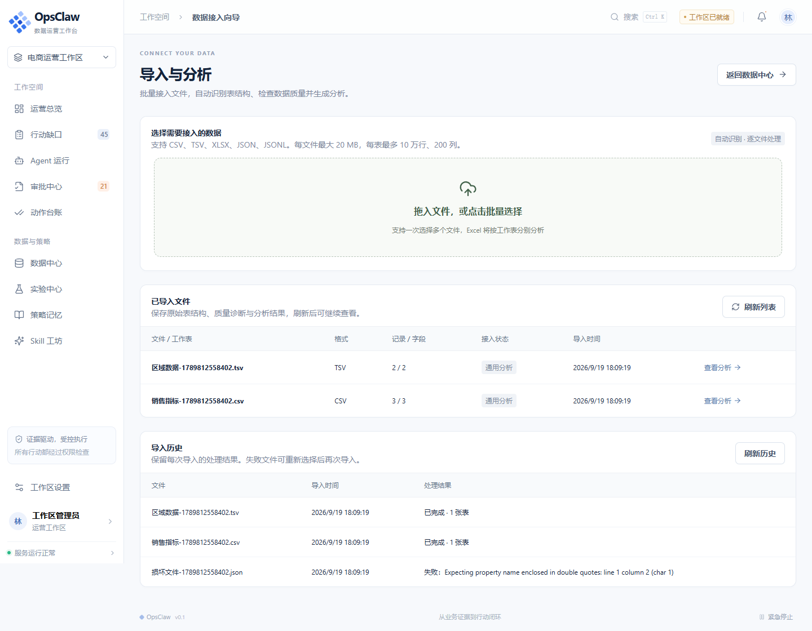

进入 **数据中心 → 导入数据**，选择或拖入多个文件。支持 CSV、TSV、XLSX、JSON 对象数组与 JSONL；Excel 工作簿中的非空工作表分别保存为数据集。页面逐文件显示处理结果，失败文件可以单独重试。
格式不支持、文件为空或超过 20 MB 时，页面会直接提示更换文件；服务端处理失败的文件可以单独重试。

导入完成后可以查看字段类型、缺失值、重复行、数值统计、高频值和记录预览。分析结果与导入历史保存在本机工作区，刷新页面后仍可查看。数值统计基于文件记录，缺失值与重复行会保留并标记，便于核对来源。

符合客户、订单、行为、触达、任务或售后字段要求的数据，可以从分析详情中接入业务检测。请先接入客户档案，再接入关联记录；字段缺失、客户关联错误和不合规金额会给出具体错误。接入后可继续使用检测、调查、方案审阅与执行跟踪流程。

完整接口、数据格式与限制见 [文件导入 API](docs/IMPORTS.md)。

单文件上限为 20 MB，每张表最多 10 万行、200 列。大量文件按队列处理，上传期间请保持页面打开。

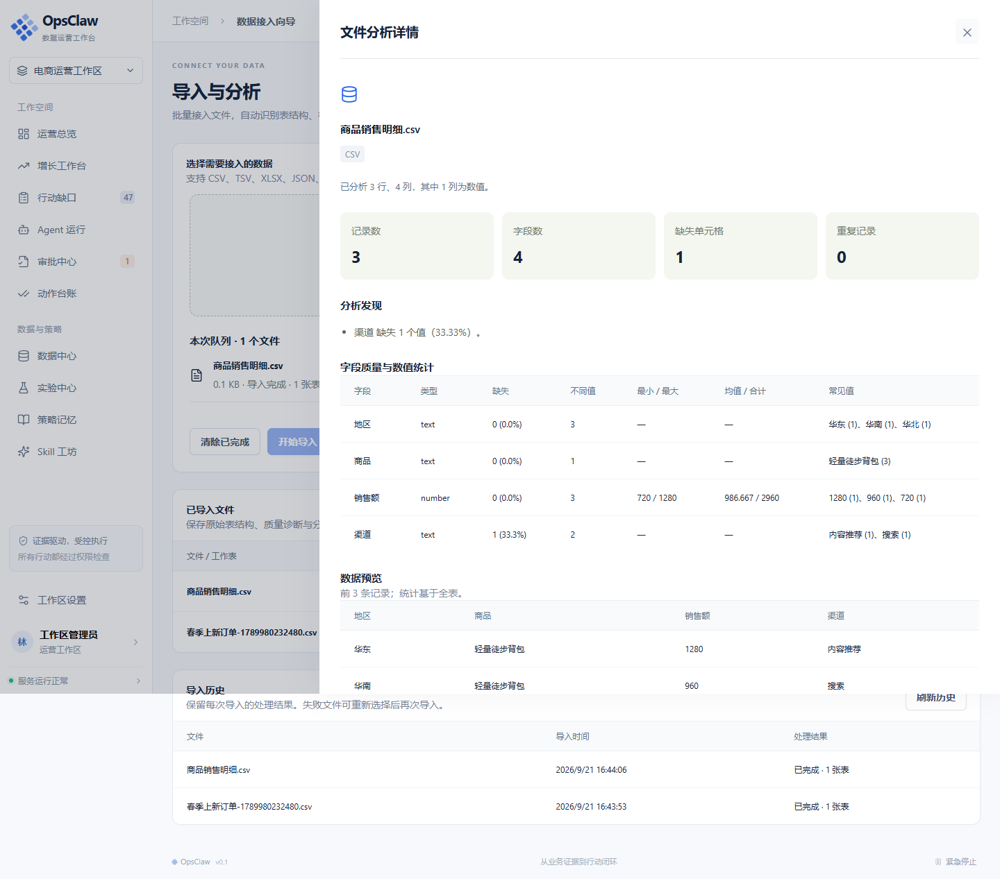

## 增长工作台

1. 导入订单文件，在「订单与诊断」确认字段、金额单位与时间覆盖，自动分析订单量和净 GMV 同比。
2. 结合站内行为和外部公告复核异常，将有效线索整理为监控因子，填写官网来源后启用。
3. 登记内容资产，依据已审核事件、潜在人群规模、转化率和客单价测算预算，提交投放或充值方案。
4. 批准具体动作后执行；持续读取广告绩效，根据已授权的生命周期策略降低预算或停止投放。

例如，某款商品出现订单异常时，可对照收藏和咨询变化，再核对品牌官方促销公告，将“促销节点可能影响商品需求”列为待验证因子并持续关注。新品发布、库存补货、节假日和季节性需求也可作为排查线索，须结合实际数据核验。

外部连接由使用者配置。复制 [环境变量模板](backend/.env.example) 为本机 `backend/.env`，填写 Brave、行为采集和广告适配服务凭据并重启 API。文件分析不依赖这些外部服务；广告未配置时显示待配置。

详见 [增长流程、配置与 API 协议](docs/GROWTH.md)。其中说明了官方平台入口、增量采集游标、广告幂等回执、人工复核和后台调度方式。

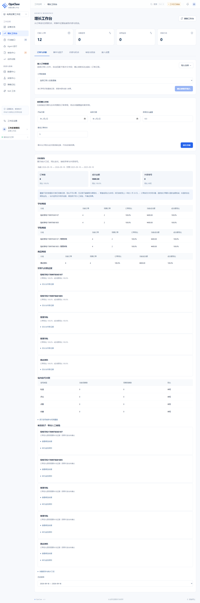

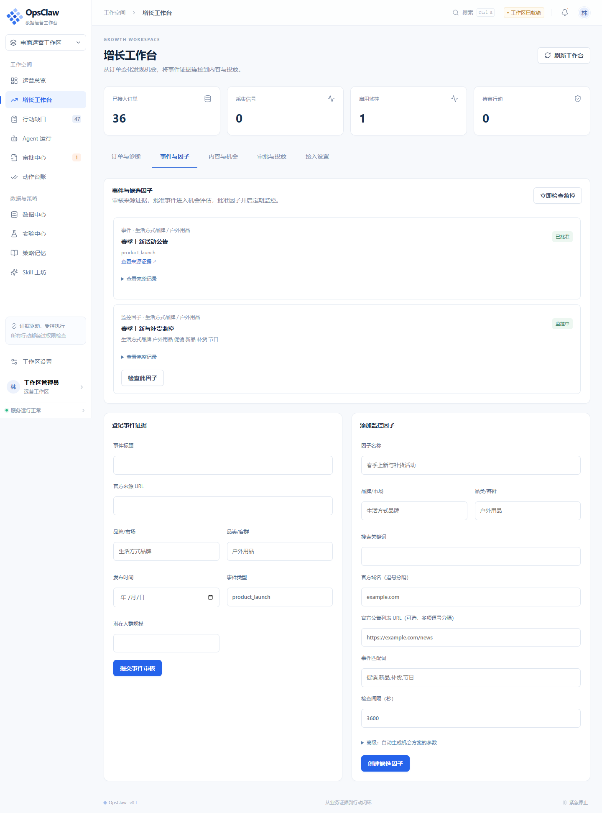

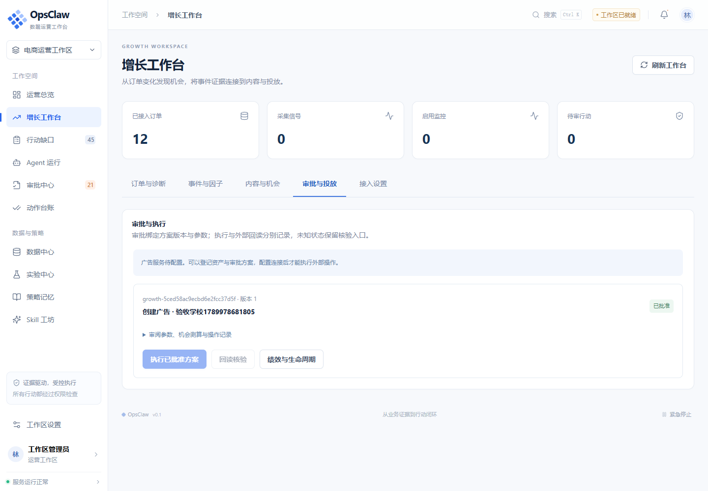

## Agent 与模型

模型接入和 Agent 执行详见 [模型连接与 Agent 工作台](docs/AGENTS.md)。在「Agent」页面配置模型连接后，可以直接使用模板、创建自定义 Agent，或让模型根据需求生成可编辑配置。

1. 在「模型连接」选择服务预设或填写自定义地址，保存 API Key 与模型，测试连接。
2. 从六种模板中选择 Agent，或按需求生成草稿，配置指令、模型和工具后启用。
3. 输入任务并选择允许读取的数据集，运行后查看分析结果、调用步骤和运行历史。

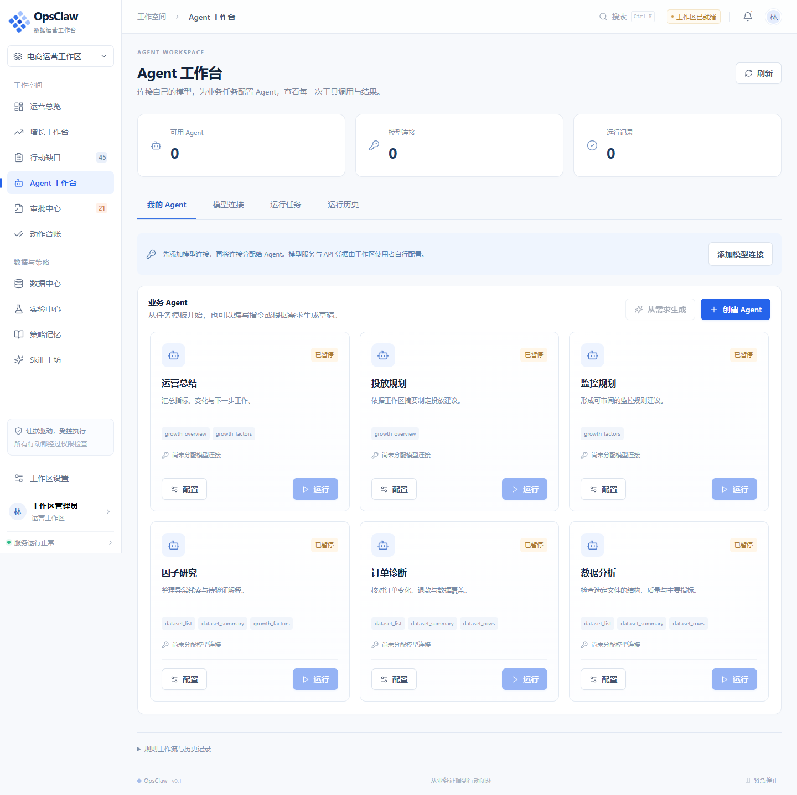

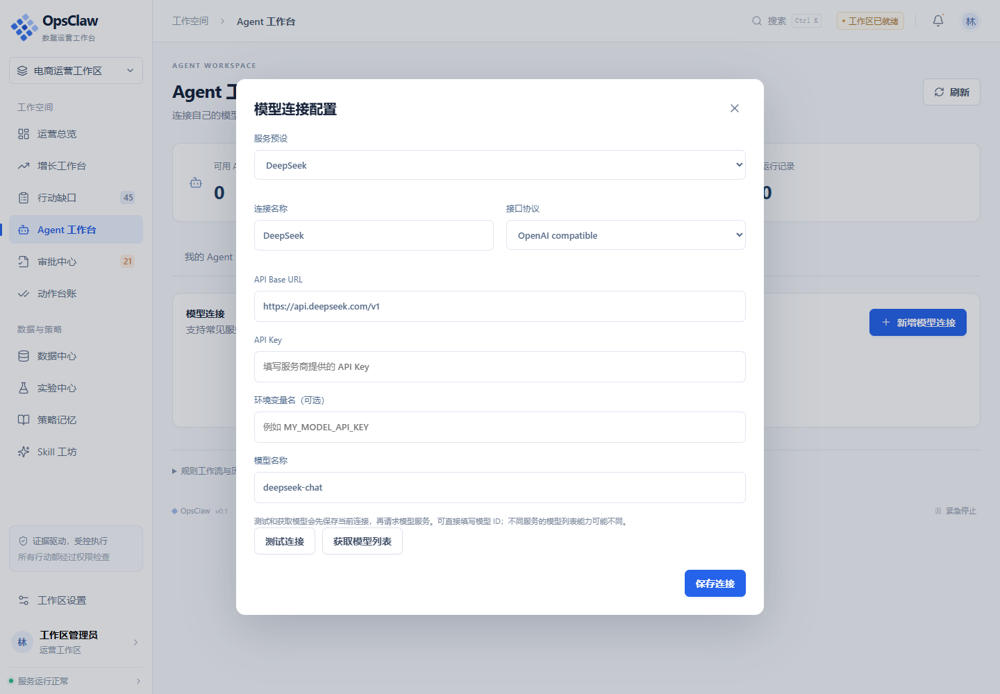

## 架构与边界

OpsClaw 将确定性业务逻辑、模型推理和真实执行分开处理：

- **规则与数据层**：金额、订单量、同比、客户价值、任务状态、ROI、幂等校验等可以明确计算的结果，由 Python / SQL / 后端规则完成，不交给模型猜测。
- **内部 Agent**：用户直接在 OpsClaw 的 Agent 页面提出任务，模型读取被授权的数据集和工具，根据当前结果决定下一步调用什么工具，并在最多 6 轮调用内形成分析或建议。
- **外部 Agent**：企业如果已经在 Claude、Codex、GPT 或自己的 Agent 中工作，可以通过 MCP 直接调用 OpsClaw 暴露的 Skill、业务上下文和授权工具，而不必切换到 OpsClaw 界面。
- **人工与执行层**：会影响客户、预算或真实业务状态的动作继续走审批、幂等、回读和审计；模型有分析和建议能力，但不会因为“能调用工具”就自动获得高风险执行权限。

内部 Agent 和外部 Agent 不是两套业务系统。它们是两个不同入口，共用下方的数据、规则与 Tool。正常情况下，外部 Agent 直接调用 OpsClaw 的业务 Tool，不需要再套一层 OpsClaw 内部模型，从而避免不必要的 Agent 套 Agent。

Skill 也不用于重复描述已经写死在代码里的数学规则。它更适合保存可变化的业务 SOP，例如调查顺序、证据要求、输出格式和禁止事项；确定性阈值和计算继续保留在后端规则中。

## Skill 与 MCP

在 **Skill 工坊** 创建工作指令，定义 JSON Schema 输入参数，并选择需要使用的工具。保存后即可管理 Skill 的版本与启用状态。

连接其他 Agent：

1. 启动 OpsClaw，进入 **Skill 工坊 → MCP 接入**。
2. 复制页面生成的配置，添加到 Agent 客户端的 MCP 配置中。
3. 连接后获取 Skill，提交参数并调用授权工具。

MCP 使用 **stdio** 传输，提供以下接口：

| 接口 | 用途 |
|---|---|
| `list_skills` / `get_skill` | 列出 Skill、读取指令和参数定义 |
| `run_skill` | 校验输入，获取 Skill 指令与业务上下文 |
| `invoke_skill_tool` | 调用 Skill 授权的业务工具 |
| `console_summary` | 获取工作区概况 |
| `opsweaver://skills/{skill_id}` | 读取 Skill 资源 |
| `use_skill` | 获取 Skill 提示词 |

查看 [MCP 配置示例](mcp.config.example.json) 与 [接入文档](docs/MCP.md)。

## 开发

### 开发模式

保持两个后端服务运行，在前端终端使用 `pnpm dev` 替代 `pnpm start`，启用热更新。

```powershell
Set-Location .\web
pnpm dev
```

开发前端与生产前端共用 3100 端口，切换前按 `Ctrl+C` 停止运行中的前端。

### 构建与检查

```powershell
Push-Location .\web
pnpm typecheck
pnpm build
Pop-Location
```

更新生产版本时，停止前端、执行 `pnpm build`，然后使用 `pnpm start` 重新启动。

### 测试

后端测试：

```powershell
Push-Location .\backend
.\.venv\Scripts\python.exe -m pytest tests -q
Pop-Location
```

浏览器测试使用 Google Chrome，运行前启动三个服务：

```powershell
Push-Location .\web
pnpm exec playwright test
Pop-Location
```

## 技术栈

| 模块 | 技术 |
|---|---|
| 前端 | Next.js 16、React 19、TypeScript |
| 数据与可视化 | TanStack Query、ECharts、React Flow |
| 后端 | Python、FastAPI、Pydantic、SQLite |
| Agent 接口 | MCP SDK、JSON Schema、HTTPX |
| 测试 | pytest、Playwright |

## 项目结构

```text
.
├── web/                      # Web 前端、页面组件与浏览器测试
├── backend/
│   ├── opsweaver/            # 业务逻辑、API、数据查询与 MCP
│   ├── tests/                # 后端测试
│   └── requirements.lock.txt # 后端依赖锁定文件
├── docs/                     # 接入文档与运行截图
└── mcp.config.example.json   # MCP 配置示例
```
