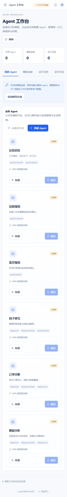

# 模型连接与 Agent 工作台

在侧边栏进入「Agent」，可以配置模型服务、管理 Agent、根据需求生成配置，并查看每次任务的工具调用与输出。


## 内部 Agent 与外部 Agent

OpsClaw 支持两种使用方式，它们共享同一套数据、规则和业务工具：

1. **内部 Agent**：用户直接在 OpsClaw 的 Agent 页面输入任务，所选大模型根据 Agent 指令和当前工具结果决定下一步调用什么工具，完成多轮分析后输出结论。
2. **外部 Agent**：Claude、Codex、GPT 或企业自建 Agent 通过 MCP 读取 Skill、业务上下文和授权工具，在外部客户端中完成推理与交互。

两者不是“一个 Agent 再调用另一个 Agent”的默认关系。外部 Agent 接入时，优先直接复用 OpsClaw 的底层 Tool；内部 Agent 则是 OpsClaw 自己提供的原生交互入口。

OpsClaw 仍然把确定性逻辑留在后端。例如金额、订单量、同比、客户价值、ROI、任务状态和幂等检查由代码或数据库计算；模型主要负责理解任务、选择工具、综合多来源证据和形成建议。涉及审批、CRM 执行、充值或预算修改等高风险动作时，继续走既有人工审批和审计流程。

## 配置模型服务


在模型连接中选择服务预设，填写服务地址、API Key 和模型名称后保存。支持两种协议：

| 协议 | 可接入服务 | 地址示例 |
|---|---|---|
| OpenAI 兼容 | OpenAI、DeepSeek、通义千问、OpenRouter、自建推理服务 | `https://api.deepseek.com/v1` |
| OpenAI 兼容本地服务 | Ollama、vLLM | `http://localhost:11434/v1` |
| Anthropic | Claude API | `https://api.anthropic.com/v1` |

地址填写 API 基础地址，不包含 `chat/completions` 或 `messages`。模型名称按服务商实际提供的名称填写；支持模型列表接口的服务可直接拉取列表。选择支持工具调用的模型，才能让 Agent 自动读取数据并分步骤分析。

保存后使用「测试连接」发送一次实际模型请求。保存配置本身不表示服务已连通。服务商账户、Key 和本地推理服务均由使用者自行配置，测试连接和运行任务会消耗对应模型服务的额度。

Key 只保存在服务端工作区的 `credentials` 目录，接口仅返回配置状态。也可填写环境变量名，由 API 进程读取对应值；修改 `backend/.env` 后需重启 API。直接在页面保存连接即可使用，编辑时留空 Key 会保留原凭据。凭据目录已加入 Git 忽略规则。页面不会回显 Key。

## 使用与自定义 Agent

工作台提供数据分析、订单诊断、因子研究、监控规划、投放规划和运营总结等 Agent 模板。给 Agent 选择模型连接、配置指令和工具后启用，再输入任务运行。

自定义 Agent 可以填写名称、职责、工作指令和允许使用的工具。也可以输入自然语言需求，例如：

> 分析已导入的商品销售数据，关注促销前后的订单变化，列出证据不足的判断，并给出下周补货建议。

「按需求生成」会调用所选模型生成可编辑的 Agent 配置。检查并保存后才成为工作区 Agent；生成配置不会启动业务操作。

## 数据与执行过程

运行时选择本次任务允许读取的数据集。数据集工具只读取选中的文件数据；未选择时不会自动把全部导入文件发送给模型。若授予增长工具，Agent 可读取相应的增长汇总或商业因子。被调用工具返回的内容会发送至当前所选模型服务。

| 工具 | 作用 |
|---|---|
| `dataset_list` | 查看本次允许访问的数据集 |
| `dataset_summary` | 查看字段统计、数据质量和分析摘要 |
| `dataset_rows` | 分页读取有限数量的记录 |
| `growth_overview` | 获取增长分析汇总 |
| `growth_factors` | 获取商业监控因子及规则配置 |

运行记录保存任务、状态、工具调用、工具结果、最终输出、用量和错误。每次任务最多进行 6 轮模型调用，总时限为 120 秒，同一工作区最多同时运行 3 个任务。模型失败、超时或进程中断不会被标记为成功；运行期间不能修改任务正在使用的模型连接。

Agent 生成的投放规划进入人工判断流程，当前这些工具用于读取与分析。广告充值、预算修改与投放执行继续使用增长工作台已有的具体方案审核和执行流程。

## HTTP API

以下接口使用工作区会话，响应均封装在 `data` 中：

| 方法 | 路径 | 用途 |
|---|---|---|
| GET | `/api/v1/ai/workspace` | 连接、Agent、运行记录、预设与工具目录 |
| POST | `/api/v1/ai/providers` | 新增或修改模型连接 |
| DELETE | `/api/v1/ai/providers/{id}` | 删除未被 Agent 使用的连接 |
| POST | `/api/v1/ai/providers/{id}/test` | 实际请求模型测试连接 |
| POST | `/api/v1/ai/providers/{id}/models` | 拉取模型列表 |
| POST | `/api/v1/ai/agents` | 保存 Agent 配置 |
| DELETE | `/api/v1/ai/agents/{id}` | 删除 Agent |
| POST | `/api/v1/ai/generate` | 按需求生成待保存的配置 |
| POST | `/api/v1/ai/runs` | 提交任务，返回 202 和运行 ID |
| GET | `/api/v1/ai/runs/{id}` | 查询任务状态、步骤和输出 |

提交任务示例：

```json
{"agent_id":"agent-id","task":"分析促销期间的销售变化与数据缺失情况","dataset_ids":["dataset-id"]}
```

Agent 配置使用 `provider_id` 关联模型连接，`tools` 指定工具名称数组，`status` 为 `active` 或 `paused`。运行服务需要 API 进程持续在线。


